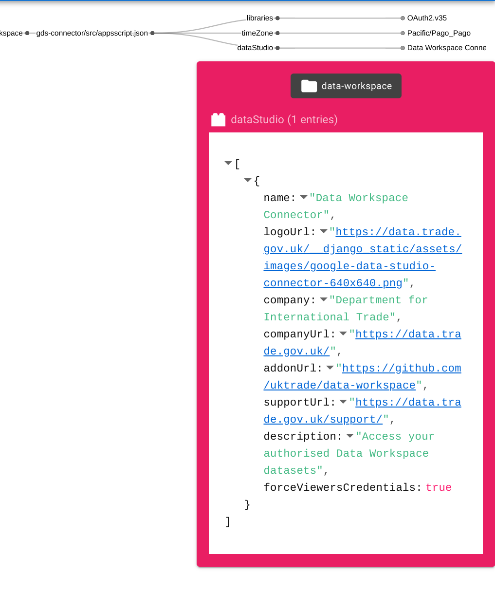
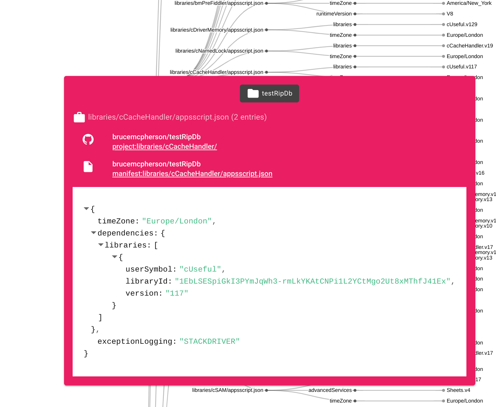

There are so many Apps Script projects out there where the source code is published on Github, but it’s hard to find what you want. Whether it’s a library, an example of an add-on, how to use an advanced service, or just see who is working on what. I fugured it would be nice if we had a searchable visualization of everything that’s public.

## writeup

https://ramblings.mcpher.com/vizzy-scrviz/

## live app

https://scrviz.web.app

## the data

https://ramblings.mcpher.com/vizzy-scrviz/searching-github-gas/

## screen shots

Summary view


Detail view with filter and owner info


Filtered view of manifest entry


Filtered view of manifest contents


## scrviz now supports creating apps script projects directly

https://ramblings.mcpher.com/vizzy-scrviz/vizzy-clone-apps-script-github/

## icons available for scrvizprofile

Any icon from material design icons site can be added to your scrviz-profile.json. These must be specified in full (including the 'mdi-')

```
rows: [
{
    ...etc,
    "icon": "mdi-google-ads"
}
]
```

However, to preserve some kind of conformity across users, a set of short names is available and preferred. Here's the list in no particular order. Many of these are also used in the app itself. If you'd like one added, let me know. Note that some are actually images rather than logos.

You'd use these like this

```
rows: [
{
    ...etc,
    "icon": "youtube"
}
]
```

| icon                                                          | built in name   |
| ------------------------------------------------------------- | ------------ |
|                   | json         |
|                     | tags         |
|                  | excel        |
|                   | word         |
|                 | office       |
|                | windows      |
|                          | youtube      |
|                         | linkedin     |
|                      | info         |
|                       | filter-off   |
|                           | filter-on    |
|                      | open         |
|                  | company      |
|                   | word         |
|                 | office       |
|                | windows      |
|                          | youtube      |
|                         | linkedin     |
|                      | info         |
|                       | location     |
|                            | email        |
|                        | files        |
|                             | file         |
|                           | github       |
|                  | clasp        |
|                        | stats        |
|                              | webapp       |
|                      | access       |
|                          | viz-info     |
|                           | repos        |
|                         | libraries    |
|                          | twitter      |
|                      | maps         |
|                              | bio          |
|                    | fees         |
|                         | support      |
|                             | text         |
|                    | fees         |
|                     | hireable     |
|                 | hireable-off |
|                             | text         |
|                    | followers    |
|                          | version      |
|                          | symbol       |
|                          | blog         |
|                       | id           |
|                        | auth         |
|                   | html         |
|                     | scrviz       |
|                            | phone        |
|           | appsscript   |
|     | drive        |
|          | sheets       |
|            | docs         |
|  | calendar     |
|           | gmail        |
|          | slides       |
|                  | gcp          |
